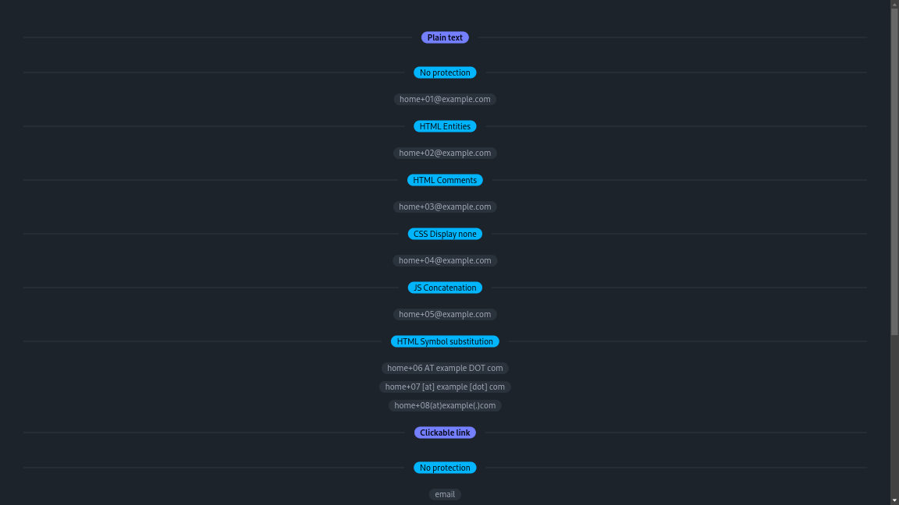
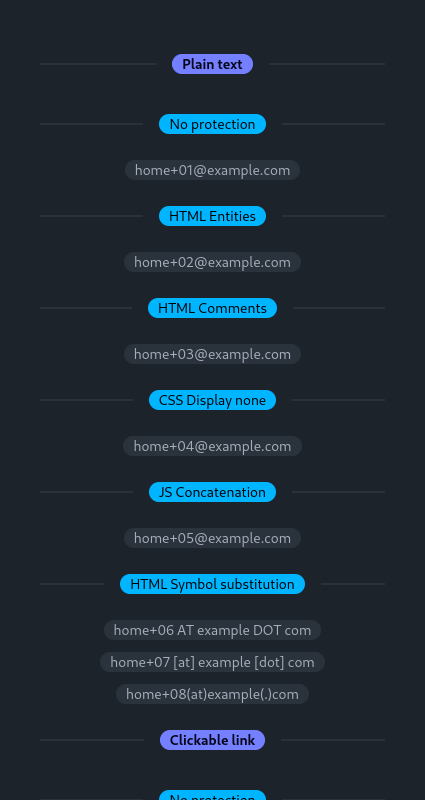

<h1 align="center">

<!-- [](https://github.com/bastean) -->

[](https://github.com/bastean/laika)

</h1>

<div align="center">

> Laika sniffs content for emails, phone numbers and social media urls.

</div>

<br />

<div align="center">

[](LICENSE)
[](https://github.com/commitizen/cz-cli)
[](https://github.com/release-it/release-it)
[](https://github.com/bastean/laika/releases)

</div>

<div align="center">

[](https://github.com/bastean/laika/actions/workflows/upgrade.yml)
[](https://github.com/bastean/laika/actions/workflows/ci.yml)
[](https://github.com/bastean/laika/actions/workflows/release.yml)

</div>

## Features

- Plain text

  - No protection

    - [x] Emails
    - [ ] Phone Numbers
    - [ ] Social Media URLs

  - HTML Entities

    - [x] Emails
    - [ ] Phone Numbers
    - [ ] Social Media URLs

  - HTML Comments

    - [x] Emails
    - [ ] Phone Numbers
    - [ ] Social Media URLs

  - CSS Display none

    - [ ] Emails
    - [ ] Phone Numbers
    - [ ] Social Media URLs

  - JS Concatenation

    - [x] ~Emails
    - [ ] Phone Numbers
    - [ ] Social Media URLs

  - HTML Symbol substitution

    - [ ] Emails
    - [ ] Phone Numbers
    - [ ] Social Media URLs

- Clickable link

  - No protection

    - [x] Emails
    - [ ] Phone Numbers
    - [ ] Social Media URLs

  - HTML entities

    - [x] ~Emails
    - [ ] Phone Numbers
    - [ ] Social Media URLs

  - URL encoding

    - [ ] Emails
    - [ ] Phone Numbers
    - [ ] Social Media URLs

  - Concatenation JS

    - [ ] Emails
    - [ ] Phone Numbers
    - [ ] Social Media URLs

## CLI

### Installation

```bash
go install github.com/bastean/laika/cmd/laika@latest
```

### Usage

```bash
laika -h
```

```text
Usage: laika [OPTIONS] sources...

Sniffs the content of the sources

E.g.: laika -jsonStore "laika" -urls -emails http://localhost:8080/

  -emails
    	Sniff emails in the content (Required)
  -jsonStore string
    	Store filepath to save the sniffed content (default "In Memory")
  -silent
    	Do not show the sniffed content
  -urls
    	If the sources for sniffing content are urls (Required)
```

## Sniff Test Server

### Installation

```bash
go install github.com/bastean/laika/cmd/laika-server@latest
```

### Usage

```bash
laika-server -h
```

```text
Usage: laika-server [OPTIONS]

Sniff Test Server

E.g.: laika-server -p 8080

  -p int
    	Port (default 8080)
```

## Package

### Installation

```bash
go get github.com/bastean/laika
```

### Update

```bash
go get -u github.com/bastean/laika
```

### Usage

#### In Memory Store

```go
package main

import (
	"log"

	"github.com/bastean/laika"
)

func main() {
	// Test Server
	sources := []string{"http://localhost:8080/"}

	// Alias for "nil"
	inMemory := laika.NewInMemoryStore()

	fromZero := laika.NewEmptyData()

	sniff := laika.New(fromZero)

	sniff.SetStore(inMemory)

	// Sniffs all HTML recursively
	sniff.ContentFromUrls(sources)

	// Sniffs all emails in the sniffed HTML
	sniff.EmailsFromContent()

	// Return an array with all emails sniffed from the HTML
	emails := sniff.SniffedEmails()

	log.Println(emails)
}
```

#### Local Json Store

```go
package main

import (
	"log"

	"github.com/bastean/laika"
)

func main() {
	// Test Server
	sources := []string{"http://localhost:8080/"}

	localJson := laika.NewLocalJsonStore(".", "laika")

	fromExistingData, err := laika.ReadDataFromStore(localJson)

	if err != nil {
		fromExistingData = laika.NewEmptyData()
	}

	sniff := laika.New(fromExistingData)

	sniff.SetStore(localJson)

	// Sniffs all HTML recursively
	sniff.ContentFromUrls(sources)

	// Sniffs all emails in the sniffed HTML
	sniff.EmailsFromContent()

	// Return an array with all emails sniffed from the HTML
	emails := sniff.SniffedEmails()

	log.Println(emails)

	// Saves the sniffed data in the store
	sniff.SaveSniffed()
}
```

- **laika.json**

  ```json
  {
    "Sniffed": {
      "localhost:8080": [
        {
          "Source": "/",
          "Content": "<html>...</html>",
          "Found": {
            "Emails": ["email@example.com", "..."]
          }
        },
        {
          "Source": "/dashboard",
          "Content": "<html>...</html>",
          "Found": {
            "Emails": ["email@example.com", "..."]
          }
        },
        {
          "Source": "/dashboard/admin",
          "Content": "<html>...</html>",
          "Found": {
            "Emails": ["email@example.com", "..."]
          }
        }
      ]
    }
  }
  ```

## Screenshots

### Sniff Test Server

<div align="center">





</div>

## Tech Stack

#### Base

- [Go](https://go.dev)
- [templ](https://templ.guide)
  - [htmx](https://htmx.org)
  - [Alpine.js](https://alpinejs.dev)
  - [Tailwind CSS](https://tailwindcss.com)
    - [daisyUI](https://daisyui.com)

#### Please see

- [go.mod](go.work) (from Workspaces)
- [package.json](package.json)

## Contributing

- Contributions and Feedback are always welcome!

## License

- [MIT](LICENSE)
